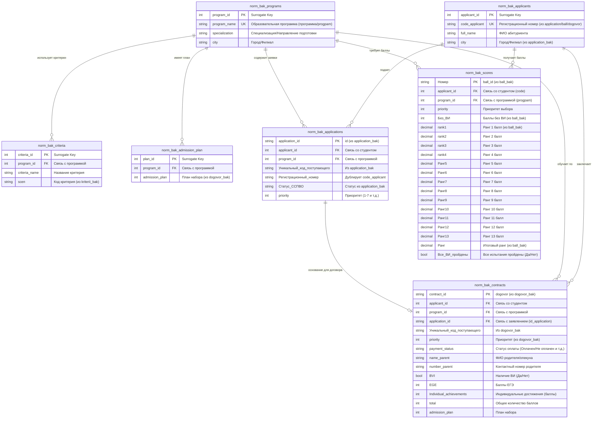

# ER Диаграмма: Нормализация данных БАКАЛАВРИАТА (3NF)

## 📊 Инвентаризация CSV файлов

| CSV файл | Строк | Столбцов | Назначение |
|----------|-------|----------|-----------|
| application_bak_rows.csv | 44,648 | 10 | Заявления абитуриентов |
| ball_bak_rows.csv | 57,030 | 23 | Баллы и рейтинги |
| dogovor_bak_rows.csv | 7,066 | 17 | Договоры |
| kriterii_bak_rows.csv | 82 | 4 | Критерии отбора программ |

---

## Mermaid ER Диаграмма (3NF)

---

## 🔗 Отображение CSV → Нормализованные таблицы

### application_bak_rows.csv → core_bak_applications + core_bak_applicants

| CSV столбец | Тип | Нормализованная таблица | Примечание |
|------------|------|----------------------|-----------|
| id | int | core_bak_applications.application_id | PK |
| Статус ССПВО | string | core_bak_applications.status | Статус |
| Уникальный код поступающего | string | core_bak_applications.unique_code | Дополнительный код |
| city | string | core_bak_applicants.city | Город |
| Регистрационный номер | string | core_bak_applicants.code_applicant | PRIMARY ID |
| full_name | string | core_bak_applicants.full_name | ФИО |
| code_applicant | string | core_bak_applicants.code_applicant | Primary ID |
| priority | int | core_bak_applications.priority | Приоритет выбора |
| specialization | string | core_bak_programs.specialization | Направление |
| program | string | core_bak_programs.program_name | Программа |

### ball_bak_rows.csv → core_bak_scores + core_bak_applicants

| CSV столбец | Тип | Нормализованная таблица | Примечание |
|------------|------|----------------------|-----------|
| Номер | string | core_bak_scores.score_id | PK |
| full_name | string | core_bak_applicants.full_name | ФИО |
| code | string | core_bak_applicants.code_applicant | FK to applicants |
| priority | int | core_bak_scores.priority | Приоритет |
| specialization | string | core_bak_programs.specialization | Направление |
| progpam | string | core_bak_programs.program_name | Программа (опечатка в CSV) |
| city | string | core_bak_applicants.city | Город |
| Без ВИ | int | core_bak_scores.score_without_vi | Баллы без ВИ |
| rank1-rank13 | decimal | core_bak_scores.rank1...rank13 | Ранги баллов |
| Ранг | decimal | core_bak_scores.final_rank | Итоговый ранг |
| Все ВИ пройдены | bool | core_bak_scores.all_vi_passed | Да/Нет |

### dogovor_bak_rows.csv → core_bak_contracts + core_bak_applicants

| CSV столбец | Тип | Нормализованная таблица | Примечание |
|------------|------|----------------------|-----------|
| dogovor | string | core_bak_contracts.contract_id | PK |
| full_name | string | core_bak_applicants.full_name | ФИО |
| code_applicant | string | core_bak_applicants.code_applicant | FK to applicants |
| Уникальный код поступающего | string | core_bak_contracts.unique_code | Доп. код |
| city | string | core_bak_applicants.city | Город |
| payment_status | string | core_bak_contracts.payment_status | Статус оплаты |
| name_parent | string | core_bak_contracts.parent_name | ФИО родителя |
| number_parent | string | core_bak_contracts.parent_phone | Телефон |
| specialization | string | core_bak_programs.specialization | Направление |
| id_application | string | core_bak_contracts.application_id | FK to applications |
| program | string | core_bak_programs.program_name | Программа |
| priority | int | core_bak_contracts.priority | Приоритет |
| admission_plan | int | core_bak_contracts.admission_plan | План набора |
| BVI | bool | core_bak_contracts.has_vi | Да/Нет |
| EGE | int | core_bak_contracts.ege_score | Баллы ЕГЭ |
| Individual_achievements | int | core_bak_contracts.individual_achievements | Баллы достижений |
| total | int | core_bak_contracts.total_score | Итого баллов |

### kriterii_bak_rows.csv → core_bak_criteria + core_bak_programs

| CSV столбец | Тип | Нормализованная таблица | Примечание |
|------------|------|----------------------|-----------|
| сцеп | string | core_bak_criteria.sceп | Код критерия |
| Направление подготовки | string | core_bak_programs.specialization | FK to programs |
| Образовательная программа | string | core_bak_programs.program_name | FK to programs |
| Критерий | string | core_bak_criteria.criteria_name | Название критерия |

---

## 📋 Сводка столбцов для каждой Core таблицы

### core_bak_applicants (DIMENSION)
- `applicant_id` (SERIAL, PK) - Surrogate key
- `code_applicant` (VARCHAR 50, UNIQUE) - Регистрационный номер
- `full_name` (VARCHAR 255) - ФИО
- `city` (VARCHAR 100) - Город/Филиал
- `Уникальный_код_поступающего` (VARCHAR 255) - Из application/dogovor
- `created_at` (TIMESTAMP)
- `updated_at` (TIMESTAMP)

### core_bak_programs (DIMENSION)
- `program_id` (SERIAL, PK) - Surrogate key
- `program_name` (VARCHAR 500, UNIQUE) - Образовательная программа
- `specialization` (VARCHAR 255) - Направление подготовки
- `city` (VARCHAR 100) - Город/Филиал
- `created_at` (TIMESTAMP)

### core_bak_criteria (DIMENSION)
- `criteria_id` (SERIAL, PK) - Surrogate key
- `program_id` (INT, FK) - Связь с программой
- `sceп` (VARCHAR 50) - Код критерия
- `criteria_name` (VARCHAR 255) - Название критерия
- `created_at` (TIMESTAMP)

### core_bak_applications (FACT)
- `application_id` (VARCHAR 50, PK) - ID заявления
- `applicant_id` (INT, FK) - Связь с абитуриентом
- `program_id` (INT, FK) - Связь с программой
- `Уникальный_код_поступающего` (VARCHAR 255) - Дополнительный код
- `priority` (INT) - Приоритет выбора
- `status` (VARCHAR 100) - Статус ССПВО
- `registration_date` (DATE) - Дата регистрации (если есть)
- `created_at` (TIMESTAMP)

### core_bak_scores (FACT)
- `score_id` (VARCHAR 50, PK) - Номер записи баллов
- `applicant_id` (INT, FK) - Связь с абитуриентом
- `program_id` (INT, FK) - Связь с программой
- `priority` (INT) - Приоритет
- `score_without_vi` (INT) - Баллы без ВИ
- `rank1` (DECIMAL) - Ранг 1
- `rank2` (DECIMAL) - Ранг 2
- `rank3` (DECIMAL) - Ранг 3
- `rank4` (DECIMAL) - Ранг 4
- `rank5` (DECIMAL) - Ранг 5
- `rank6` (DECIMAL) - Ранг 6
- `rank7` (DECIMAL) - Ранг 7
- `rank8` (DECIMAL) - Ранг 8
- `rank9` (DECIMAL) - Ранг 9
- `rank10` (DECIMAL) - Ранг 10
- `rank11` (DECIMAL) - Ранг 11
- `rank12` (DECIMAL) - Ранг 12
- `rank13` (DECIMAL) - Ранг 13
- `final_rank` (DECIMAL) - Итоговый ранг
- `all_vi_passed` (BOOLEAN) - Все ВИ пройдены
- `created_at` (TIMESTAMP)

### core_bak_contracts (FACT)
- `contract_id` (VARCHAR 50, PK) - Номер договора
- `applicant_id` (INT, FK) - Связь с абитуриентом
- `program_id` (INT, FK) - Связь с программой
- `application_id` (VARCHAR 50, FK) - Связь с заявлением (может быть NULL)
- `Уникальный_код_поступающего` (VARCHAR 255) - Доп. код
- `priority` (INT) - Приоритет
- `payment_status` (VARCHAR 100) - Статус оплаты
- `parent_name` (VARCHAR 255) - ФИО родителя
- `parent_phone` (VARCHAR 20) - Телефон родителя
- `has_vi` (BOOLEAN) - Наличие ВИ (Да/Нет)
- `ege_score` (INT) - Баллы ЕГЭ
- `individual_achievements` (INT) - Баллы достижений
- `total_score` (INT) - Итого баллов
- `admission_plan` (INT) - План набора
- `created_at` (TIMESTAMP)

### core_bak_admission_plan (DIMENSION)
- `plan_id` (SERIAL, PK) - Surrogate key
- `program_id` (INT, FK) - Связь с программой
- `admission_plan` (INT) - План набора
- `created_at` (TIMESTAMP)

---

## ✅ Проверка полноты

- [x] ВСЕ столбцы из application_bak_rows.csv включены
- [x] ВСЕ столбцы из ball_bak_rows.csv включены
- [x] ВСЕ столбцы из dogovor_bak_rows.csv включены
- [x] ВСЕ столбцы из kriterii_bak_rows.csv включены
- [x] Правильные типы данных для каждого столбца
- [x] Первичные ключи (PK) для каждой таблицы
- [x] Внешние ключи (FK) для связей
- [x] Связи 1:N между dimensions и facts

**СТАТУС: ✅ SCHEMA VERIFIED AND COMPLETE**

---

**Дата обновления**: 2026-05-16  
**Версия**: 1.1 (добавлены все столбцы из CSV)
