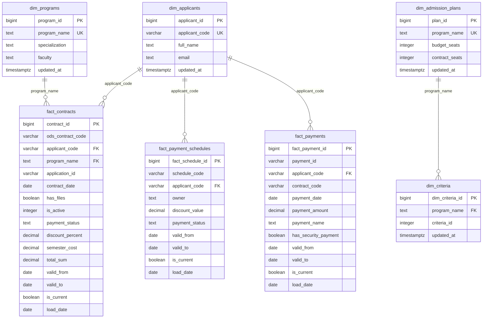

```mermaid
erDiagram

    dim_applicants {
        bigint applicant_id PK
        varchar applicant_code UK
        text full_name
        text email
        timestamptz updated_at
    }

    dim_programs {
        bigint program_id PK
        text program_name UK
        text specialization
        text faculty
        timestamptz updated_at
    }

    dim_admission_plans {
        bigint plan_id PK
        text program_name UK
        integer budget_seats
        integer contract_seats
        timestamptz updated_at
    }

    dim_criteria {
        bigint dim_criteria_id PK
        text program_name FK
        integer criteria_id
        timestamptz updated_at
    }

    fact_contracts {
        bigint contract_id PK
        varchar ods_contract_code
        varchar applicant_code FK
        text program_name FK
        varchar application_id
        date contract_date
        boolean has_files
        integer is_active
        text payment_status
        decimal discount_percent
        decimal semester_cost
        decimal total_sum
        date valid_from
        date valid_to
        boolean is_current
        date load_date
    }

    fact_payment_schedules {
        bigint fact_schedule_id PK
        varchar schedule_code
        varchar applicant_code FK
        text owner
        decimal discount_value
        text payment_status
        date valid_from
        date valid_to
        boolean is_current
        date load_date
    }

    fact_payments {
        bigint fact_payment_id PK
        varchar payment_id
        varchar applicant_code FK
        varchar contract_code
        date payment_date
        decimal payment_amount
        text payment_name
        boolean has_security_payment
        date valid_from
        date valid_to
        boolean is_current
        date load_date
    }

    dim_applicants ||--o{ fact_contracts : "applicant_code"
    dim_applicants ||--o{ fact_payment_schedules : "applicant_code"
    dim_applicants ||--o{ fact_payments : "applicant_code"
    dim_programs ||--o{ fact_contracts : "program_name"
    dim_admission_plans ||--o{ dim_criteria : "program_name"
```
