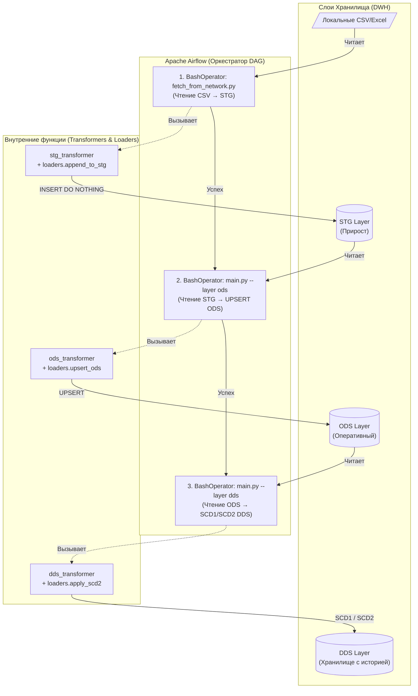

```mermaid

flowchart TD
    subgraph Airflow ["Apache Airflow (Оркестратор DAG)"]
        direction TB
        TASK_FETCH["1. BashOperator: fetch_from_network.py\n(Чтение CSV → STG)"]
        TASK_ODS["2. BashOperator: main.py --layer ods\n(Чтение STG → UPSERT ODS)"]
        TASK_DDS["3. BashOperator: main.py --layer dds\n(Чтение ODS → SCD1/SCD2 DDS)"]
        
        TASK_FETCH -->|"Успех"| TASK_ODS
        TASK_ODS -->|"Успех"| TASK_DDS
    end

    subgraph Data_Sources ["Слои Хранилища (DWH)"]
        CSV_Files[/"Локальные CSV/Excel"/]
        DB_STG[("STG Layer\n(Прирост)")]
        DB_ODS[("ODS Layer\n(Оперативный)")]
        DB_DDS[("DDS Layer\n(Хранилище с историей)")]
    end

    subgraph ETL_Modules ["Внутренние функции (Transformers & Loaders)"]
        TRANS_STG["stg_transformer\n + loaders.append_to_stg"]
        TRANS_ODS["ods_transformer\n + loaders.upsert_ods"]
        TRANS_DDS["dds_transformer\n + loaders.apply_scd2"]
    end

    %% -- Поток данных --
    CSV_Files -->|"Читает"| TASK_FETCH
    TASK_FETCH -.->|"Вызывает"| TRANS_STG
    TRANS_STG -->|"INSERT DO NOTHING"| DB_STG

    DB_STG -->|"Читает"| TASK_ODS
    TASK_ODS -.->|"Вызывает"| TRANS_ODS
    TRANS_ODS -->|"UPSERT"| DB_ODS

    DB_ODS -->|"Читает"| TASK_DDS
    TASK_DDS -.->|"Вызывает"| TRANS_DDS
    TRANS_DDS -->|"SCD1 / SCD2"| DB_DDS
```