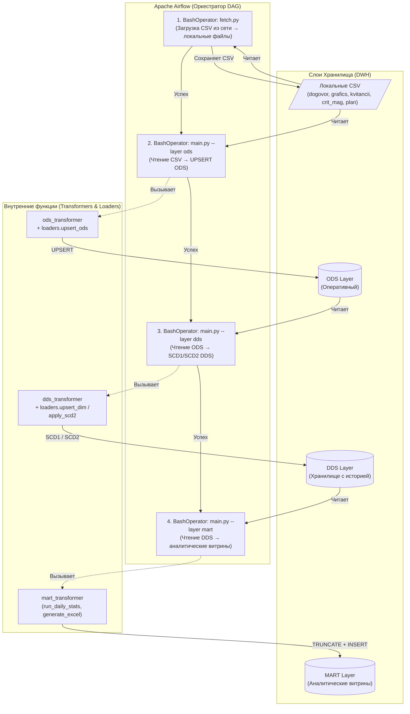

```mermaid

flowchart TD
    subgraph Airflow ["Apache Airflow (Оркестратор DAG)"]
        direction TB
        TASK_FETCH["1. BashOperator: fetch.py\n(Загрузка CSV из сети → локальные файлы)"]
        TASK_ODS["2. BashOperator: main.py --layer ods\n(Чтение CSV → UPSERT ODS)"]
        TASK_DDS["3. BashOperator: main.py --layer dds\n(Чтение ODS → SCD1/SCD2 DDS)"]
        TASK_MART["4. BashOperator: main.py --layer mart\n(Чтение DDS → аналитические витрины)"]

        TASK_FETCH -->|"Успех"| TASK_ODS
        TASK_ODS -->|"Успех"| TASK_DDS
        TASK_DDS -->|"Успех"| TASK_MART
    end

    subgraph Data_Sources ["Слои Хранилища (DWH)"]
        CSV_Files[/"Локальные CSV\n(dogovor, grafics, kvitancii, crit_mag, plan)"/]
        DB_ODS[("ODS Layer\n(Оперативный)")]
        DB_DDS[("DDS Layer\n(Хранилище с историей)")]
        DB_MART[("MART Layer\n(Аналитические витрины)")]
    end

    subgraph ETL_Modules ["Внутренние функции (Transformers & Loaders)"]
        TRANS_ODS["ods_transformer\n + loaders.upsert_ods"]
        TRANS_DDS["dds_transformer\n + loaders.upsert_dim / apply_scd2"]
        TRANS_MART["mart_transformer\n(run_daily_stats, generate_excel)"]
    end

    %% -- Поток данных --
    CSV_Files -->|"Читает"| TASK_FETCH
    TASK_FETCH -->|"Сохраняет CSV"| CSV_Files

    CSV_Files -->|"Читает"| TASK_ODS
    TASK_ODS -.->|"Вызывает"| TRANS_ODS
    TRANS_ODS -->|"UPSERT"| DB_ODS

    DB_ODS -->|"Читает"| TASK_DDS
    TASK_DDS -.->|"Вызывает"| TRANS_DDS
    TRANS_DDS -->|"SCD1 / SCD2"| DB_DDS

    DB_DDS -->|"Читает"| TASK_MART
    TASK_MART -.->|"Вызывает"| TRANS_MART
    TRANS_MART -->|"TRUNCATE + INSERT"| DB_MART
```
